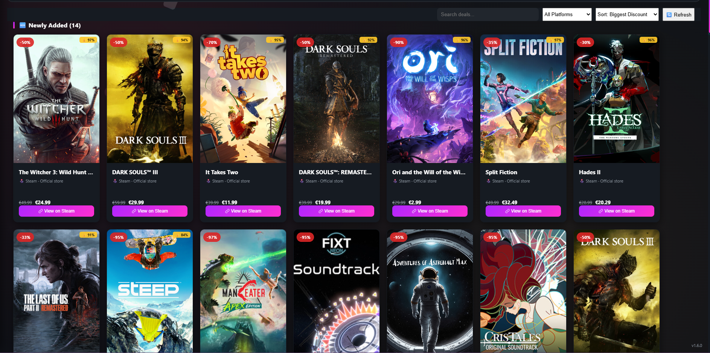

# Riftgate

**Your games. Your apps. Your media. One gateway.**

A unified desktop launcher — organize your installed games and apps,
discover what's free or on sale right now across Steam, GOG, Epic, and
dozens of other stores, and keep track of the movies and shows you care
about, all in one place.

---

## Download

### 👉 [Download the latest version](https://github.com/Raidex81/Riftgate/releases/latest)

On that page, open **Assets** and pick the file for your computer:

| Computer | File |
|---|---|
| Windows 10/11 | `Riftgate-Setup-<version>.exe` |
| Mac with Apple chip (M1/M2/M3/M4…) | `Riftgate-<version>-arm64.dmg` |
| Mac with Intel chip | `Riftgate-<version>.dmg` |

> **Windows first-install note:** Windows may show a blue "Windows
> protected your PC" screen the first time you run the installer. This
> is normal for independently-published apps that aren't digitally
> signed — click **More info → Run anyway** to continue. It only happens
> once: every update after that installs itself automatically through
> the app.
>
> **Mac first-install note:** open the `.dmg`, drag Riftgate into
> Applications, then **right-click → Open** the first time (or System
> Settings → Privacy & Security → **Open Anyway**). If macOS says the app
> "is damaged", run `xattr -cr /Applications/Riftgate.app` in Terminal
> and open it again. The Mac version isn't signed yet, so it can't update
> itself — download the new `.dmg` from the link above for each new
> version (your library and settings are kept).

---

## What's inside

**📀 Installed Library** — organize every game, app, and VR title you
run, with drag-and-drop reordering, auto-fetched cover art and
descriptions, and hover trailers.

**🎁 Free Games** — a live, auto-updating list of what's free to keep
or free to play right now on Steam, Epic Games, GOG, itch.io, and
giveaway aggregators like GamerPower.

**🛒 Store** — the best discounts on PC games right now, aggregated
across Steam and dozens of other resellers (GOG, Epic, Humble,
Fanatical, GreenManGaming, and more) in one searchable, sortable grid.
Every deal shows its discount, a review-score badge (Steam rating or
Metacritic), and a trailer preview, with quick links straight to each
store to buy. Prices and currency follow your Region setting, so
they match the store you'd actually be buying from.

**🎬 Theatre** — track TV series for new episodes (with ratings and a
next-episode countdown), browse movies currently playing near you, and
jump into a full-screen trailer preview.

**📚 Reading Room** — your own eBook library (EPUB/PDF), plus Discover
Online and Buy Books tabs for free and mainstream titles, with
dedicated Manga and Comics browsing.

**🧩 Applications** — tools and apps built by the community, each with
a creator credit and a link straight to where to grab it — browse by
search or sort by newest, most visited, name, or author.

**🆕 New** — see what's newly released or coming soon across movies,
series, and games, all in one feed.

**🎲 Surprise Me** — can't decide? Spin the wheel.

**🔒 The Vault** — private file and link sharing between friends, with
automatic expiry (currently admin-only while it's being reworked).

Nine color themes (the header, accents and glow all follow the one you
pick), light/dark mode, adjustable grid density, and a fully custom
interface — automatic updates included on Windows.

---

## For developers

This is a personal project — all rights reserved. It isn't currently
open for external contributions, but feel free to look around.

Built with [Electron](https://www.electronjs.org/) for Windows and macOS
from one shared codebase, backed by [Supabase](https://supabase.com/) for
shared/cloud data (accounts, The Vault, Applications, community
suggestions). Third-party media APIs (TMDB, RAWG, SteamGridDB, YouTube)
are proxied server-side, so no vendor keys ship inside the app, and
account emails (password reset, email confirmation) are sent entirely by
the server. The database changes and server functions live in
[`supabase/`](supabase/).

For a deeper technical look — the Electron process model, IPC and
security hardening, what's stored locally vs. in the cloud, external data
sources, and the build/release pipeline — see
**[ARCHITECTURE.md](ARCHITECTURE.md)**.
