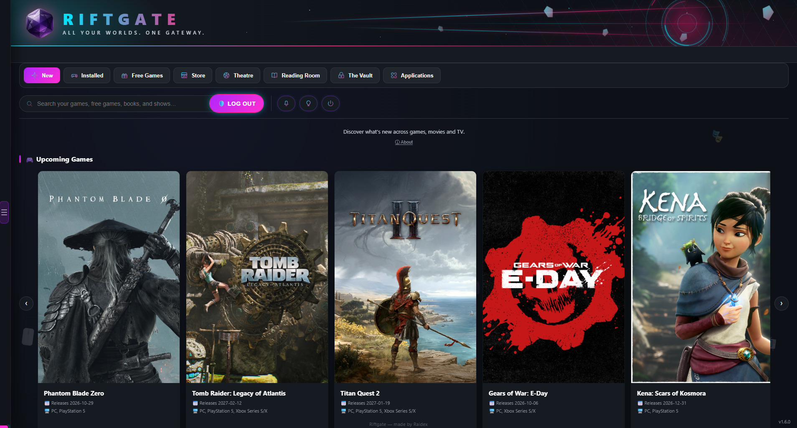
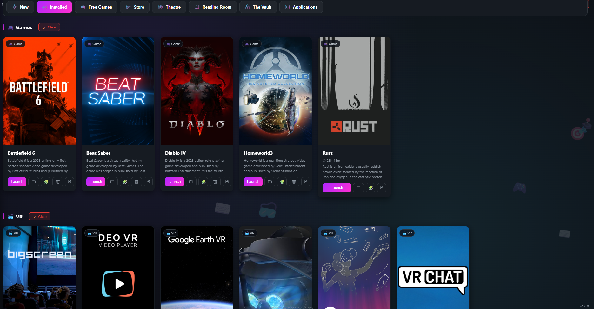
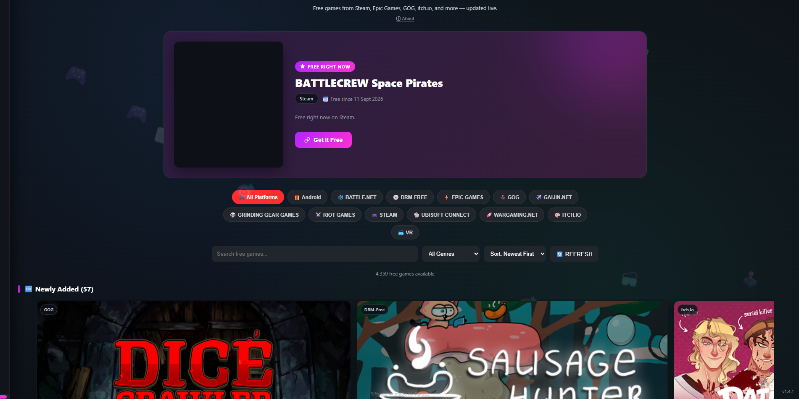
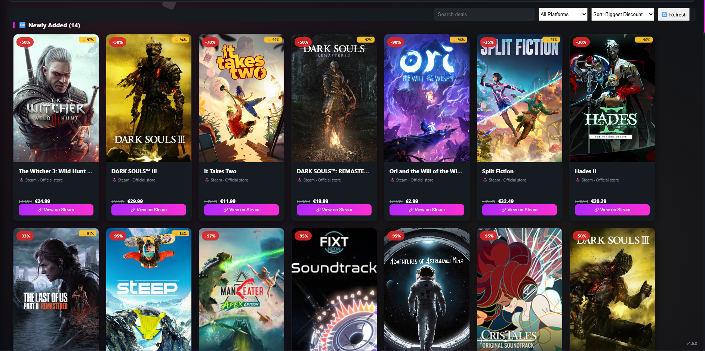
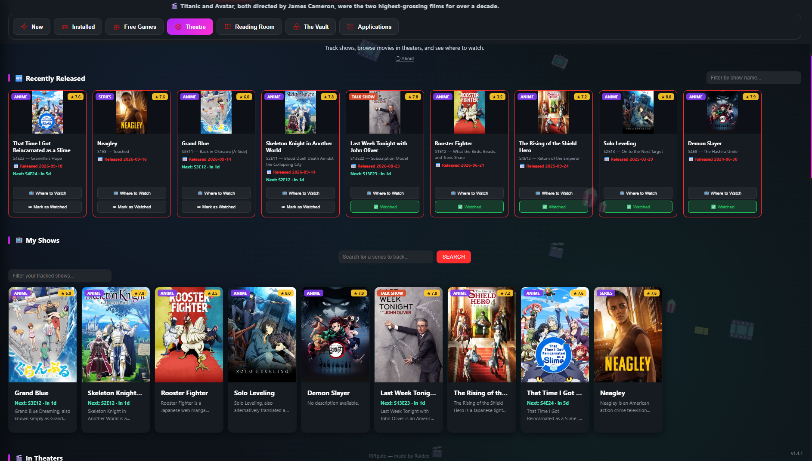
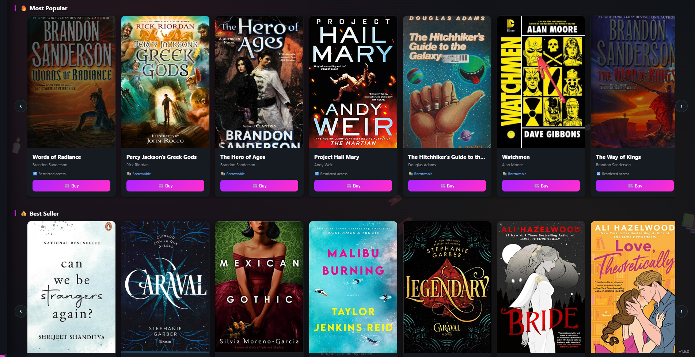
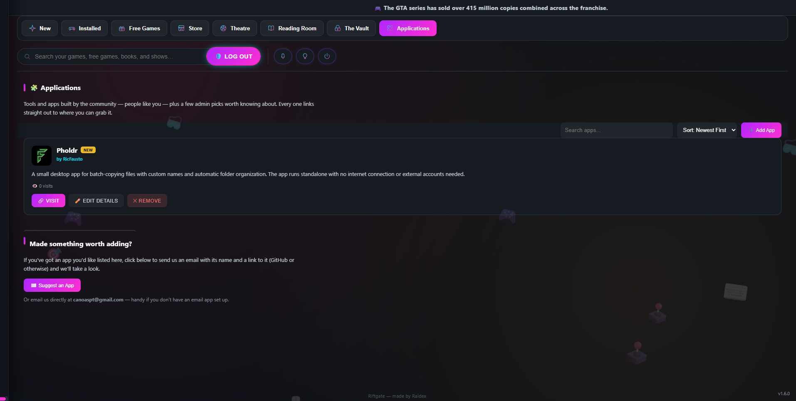
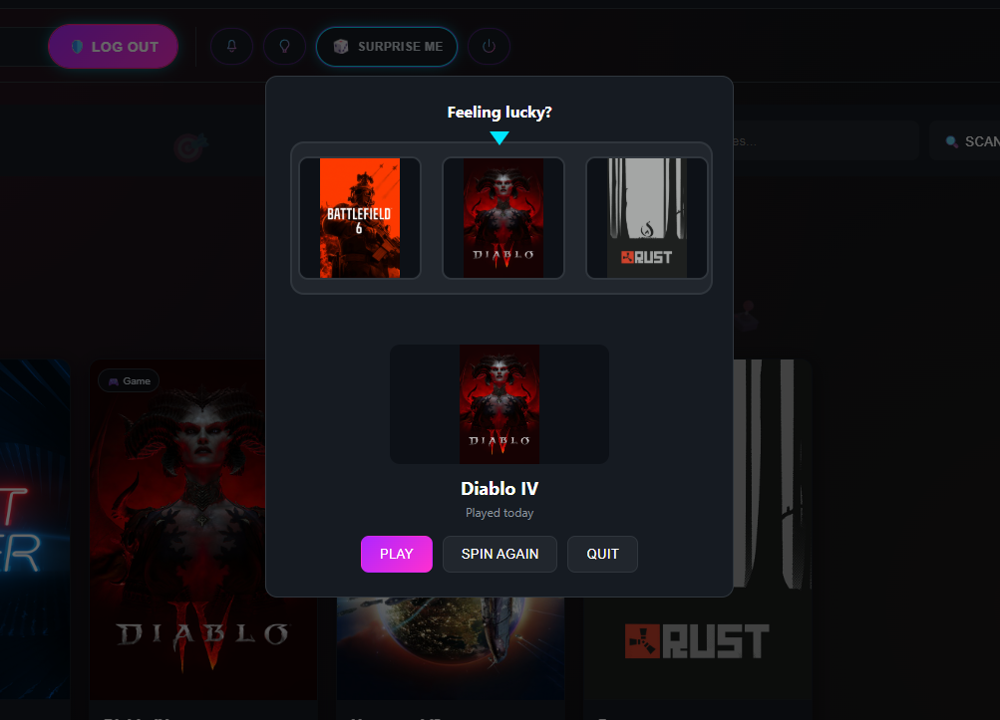

# Riftgate

**All your worlds. One gateway.**

Riftgate is a personal entertainment hub for Windows and Mac. It brings
your games, movies, TV, anime, books, apps, free content and deals
together in one desktop app — so instead of jumping between launchers,
store pages, streaming sites and release calendars, you open one window
and everything is there, up to date and in your region.

- **Play** — your whole game and app library on one shelf, with covers,
  trailers and playtime, plus new installs picked up automatically.
- **Get it free** — thousands of games that are free right now on Steam,
  Epic, GOG, itch.io and more, refreshed live.
- **Save** — the biggest PC game discounts across Steam and dozens of
  other stores, in your own currency.
- **Watch** — what's in cinemas near you, what's coming, what each
  streaming service carries, and your TV shows' next episodes.
- **Discover** — every upcoming film, game, series and anime in one feed,
  with a "See all" for the complete list.
- **Read** — your own eBook library plus free classics, best sellers,
  manga and comics.

---

## Download

### 👉 [Download the latest version](https://github.com/Raidex81/Riftgate/releases/latest)

Free. On that page, open **Assets** and pick the file for your computer:

| Computer | File |
|---|---|
| Windows 10/11 | `Riftgate-Setup-<version>.exe` |
| Mac with Apple chip (M1/M2/M3/M4…) | `Riftgate-<version>-arm64.dmg` |
| Mac with Intel chip | `Riftgate-<version>.dmg` |

> **Windows first-install note:** Windows may show a blue "Windows
> protected your PC" screen the first time you run the installer. This
> is normal for independently-published apps that aren't digitally
> signed — click **More info → Run anyway** to continue. It only happens
> once: every update after that installs itself automatically through
> the app.
>
> **Mac first-install note:** open the `.dmg`, drag Riftgate into
> Applications, then **right-click → Open** the first time (or System
> Settings → Privacy & Security → **Open Anyway**). If macOS says the app
> "is damaged", run `xattr -cr /Applications/Riftgate.app` in Terminal
> and open it again. The Mac version isn't signed yet, so it can't update
> itself — download the new `.dmg` from the link above for each new
> version (your library and settings are kept).

No account needed: everything works the moment it opens. Signing in is
only for optional extras like sending suggestions.

---

## What's inside

**🆕 New** — one feed for what's coming and what just arrived: upcoming
games, films coming to cinemas in your region, new series and new anime,
with hover trailers. Every row has a **See all** button that opens the
complete list — every film releasing in your country over the next 12
months, every upcoming game, every series and anime that started in the
last 90 days — with search and sorting.

**📀 Installed** — every game, app and VR title you run, on one shelf.
Drag a shortcut or `.exe` onto the window to add it, or let Riftgate
scan for your Steam games and installed apps; it fetches covers,
descriptions and hover trailers, tracks your playtime, and offers to add
anything you install later.

**🎁 Free Games** — a live, auto-updating collection of what's free to
keep or free to play right now: Steam, Epic Games, every free game on
GOG, itch.io, giveaway trackers like GamerPower, and the big
free-to-play titles from Battle.net, EA, Riot, Ubisoft and more — with a
dedicated VR view, genre filters and search. Rows always fill your
window, whatever its width.

**🛒 Store** — the biggest current discounts on PC games from Steam and
dozens of other stores (GOG, Epic, Humble, Fanatical, GreenManGaming and
more) in one searchable, sortable grid. Every deal shows its discount, a
review-score badge (Steam rating or Metacritic) and a trailer, with a
link straight to the store. Prices and currency follow your region.

**🎬 Theatre** — follow TV series for new episodes (with ratings and a
next-episode countdown), see what's in cinemas near you, browse what's
popular on each streaming service in your region (Netflix, Prime Video,
Disney+, Max and more — with **See all** for the full catalog), and look
up where any film or show is streaming. Every title opens a full-screen
trailer. Pick your cinema from the ones around your city and **Find
Tickets** takes you straight to that cinema's own site for sessions and
tickets.

**📚 Reading Room** — your own eBook library (EPUB/PDF, with real
covers found online), free public-domain classics, current best sellers
and new releases, and dedicated Manga and Comics shelves.

**🧩 Applications** — tools and apps built by the community, each with a
creator credit and a link to get it; search, or sort by newest, most
visited, name or author.

**🎲 Surprise Me** — can't decide what to play, watch or read? Spin the
wheel; it knows which section you're in.

**🎨 Make it yours** — nine color themes (the whole look follows the one
you pick), light and dark mode, adjustable card size, a first-run tour,
and automatic updates on Windows.

**🔒 Coming soon: The Vault** — private file and link sharing between
friends, with automatic expiry.

---

## For developers

Riftgate is open source under the [GNU GPL v3.0 or later](LICENSE), and
contributions are welcome — bug reports, ideas, fixes and new features.
Read **[CONTRIBUTING.md](CONTRIBUTING.md)** to get started: running it
from source is just `npm install` and `npm start`, no API keys needed.

Built with [Electron](https://www.electronjs.org/) for Windows and macOS
from one shared codebase, backed by [Supabase](https://supabase.com/) for
shared/cloud data (accounts, The Vault, Applications, community
suggestions). Third-party media APIs (TMDB, RAWG, SteamGridDB, YouTube)
are proxied server-side, so no vendor keys ship inside the app, and
account emails (password reset, email confirmation) are sent entirely by
the server. The database changes and server functions live in
[`supabase/`](supabase/). The cinema list comes straight from
[OpenStreetMap](https://www.openstreetmap.org/copyright) (© OpenStreetMap
contributors) and is cached for two weeks per city.

Size, as of version 1.7.2 (counted with `wc -l`, blank lines and comments
included):

| Part | Lines |
|---|---|
| App JavaScript (main process, UI logic, services) | 25,303 |
| UI markup and styles (`index.html`, `style.css`) | 7,662 |
| Backend (Supabase Edge Functions, SQL migrations and rollbacks) | 2,508 |

For a deeper technical look — the Electron process model, IPC and
security hardening, what's stored locally vs. in the cloud, external data
sources, and the build/release pipeline — see
**[ARCHITECTURE.md](ARCHITECTURE.md)**.
